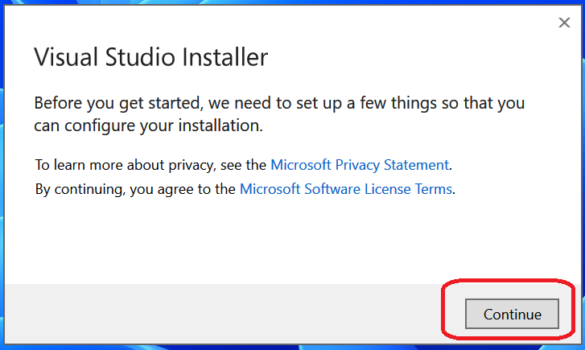
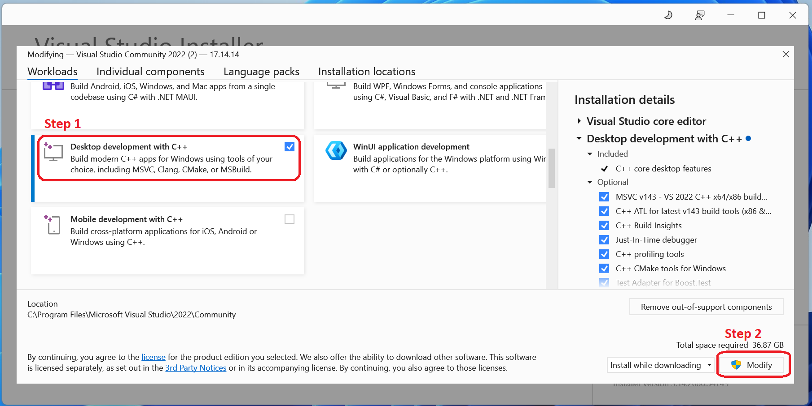
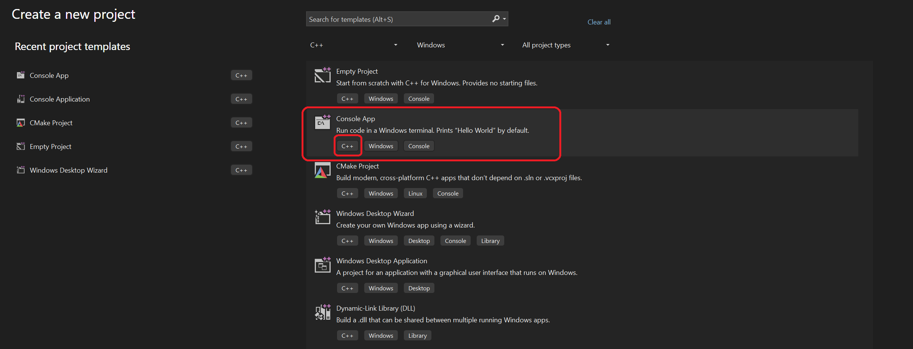
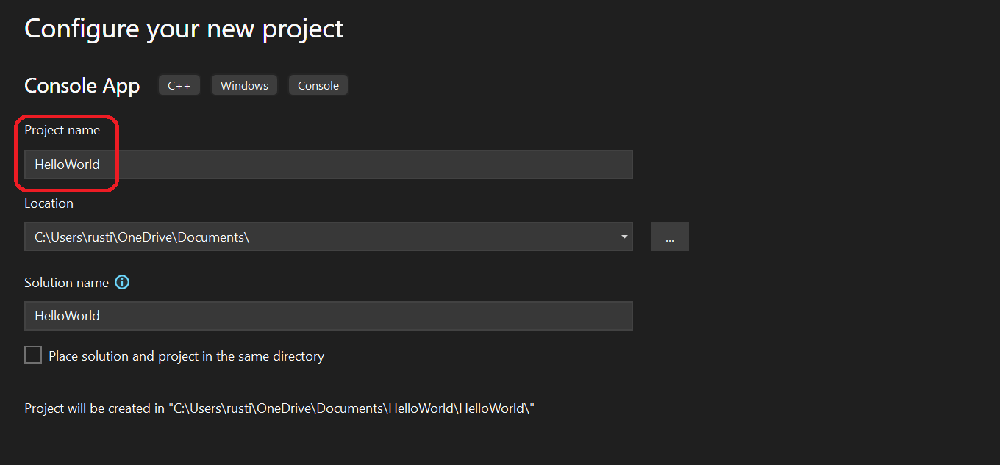
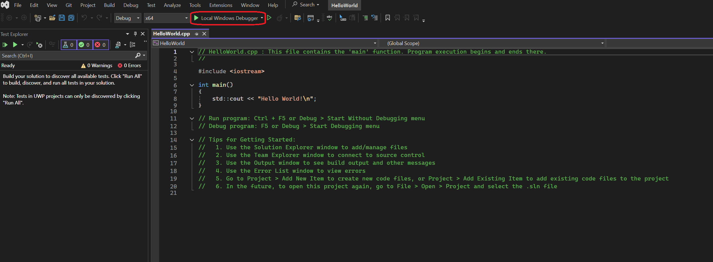
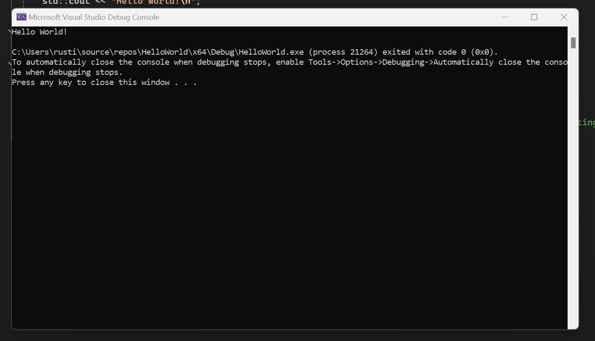

# Intro To Programming using C++

Course Material for programming class, for fall 2025 at EMS

## Equipment
- Device : Personal Laptop
- OS : Windows (any version is fine)
- Specs : intel i5 (or AMD Ryzen 5) with >=8GB RAM

## Setup
For this class students Visual Studio Community Edition from Microsoft. This can be found at [Visual Studio Community Edition](https://visualstudio.microsoft.com/vs/community/)

### Install Steps
- Dowload and run [Visual Studio Community Edition Setup](https://visualstudio.microsoft.com/thank-you-downloading-visual-studio/?sku=Community&channel=Release&version=VS2022&source=VSLandingPage&passive=false&cid=2030)
- Click Continue:

- Select "Desktop Development with C++", and Click Modify

### Verify Setup
Crate a Hello World program 
- Launch Visual Studio Community Edition from Start Menu 
- Click Create New Project, Make sure to find "Console App" with C++

- Name your project "HelloWorld", Click Next

- You should see the code like below, Click "Local Windows Debuger"

- Once you see this screen , you are done. 

#### You are now ready to start Learning

